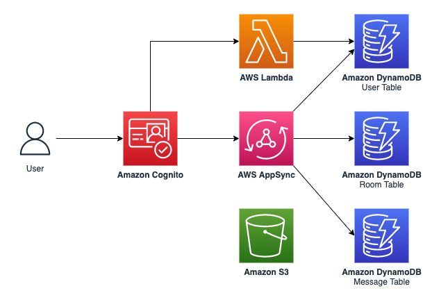

# AWS AppSync Chat App CDK Backend

## Services Used



## Amazon Cognito

The `lib/authStack.ts` file creates the following services

- Cognito user pool
- Cognito user pool group (if specified)
- Cognito identity pool

🗒️ The identity pool helps in providing IAM permission access to both authenticated and unauthenticated users as well as AWS services such as Amazon S3.

In addition, this package need to install `@aws-cdk/aws-cognito-identitypool-alpha` [npm package](https://www.npmjs.com/package/@aws-cdk/aws-cognito-identitypool-alpha)

## AWS Lambda

The `lib/lambdas` directory contains a `addUserToDB` folder. The Lambda function in this folder adds a user to DynamoDB after a user signs up through our Cognito service.

## Amazon Simple Storage Service (Amazon S3)

The `lib/fileStorageStack.ts` file creates an Amazon S3 bucket and comes configured with managed polices that are in line with what the [Amplify Storage](https://docs.amplify.aws/cli/storage/import/#configuring-iam-role-to-use-amplify-recommended-policies) library uses as acceptable defaults.

## AWS AppSync API

The`lib/apiStack.ts` file creates an AWS AppSync API.

Note that this stack comes preconfigured with the following:

- A sample graphql schema
- User pool authorization
- API Key authorization
- IAM authorization
- DynamoDB as a datasource

In addition, this package makes use of the `@aws-cdk/aws-appsync-alpha` [npm package](https://www.npmjs.com/package/@aws-cdk/aws-appsync-alpha) for easily creating the request and response mapping templates.

## Amazon DynamoDB API

The `lib/databaseStack.ts` file creates a single DynamoDB table that is used as a datasource for the AWS AppSync API above.

## Integrating with a frontend

To deploy an API for client usage, we can use the following command.

- `cdk deploy --all --outputs-file ./output.json`
  => The output.json file is generated containing the necessary configuration information for the client
- On the frontend, use of the AWS Amplify JS libraries are used to connect our frontend to our backend by means of the Amplify.configure method (sample data configs are used):

- ```typescript
  Amplify.configure({
    aws_project_region: "ap-northeast-1",
    aws_appsync_graphqlEndpoint: "your aws_appsync_graphqlEndpoint",
    aws_appsync_region: "ap-northeast-1",
    aws_appsync_authenticationType: "API_KEY",
    aws_appsync_apiKey: "your aws_appsync_apiKey",
  });
  ```

## Introduction

This is a blank project for CDK development with TypeScript.

The `cdk.json` file tells the CDK Toolkit how to execute your app.

## Useful commands

- `npm run build` compile typescript to js
- `npm run watch` watch for changes and compile
- `npm run test` perform the jest unit tests
- `cdk deploy` deploy this stack to your default AWS account/region
- `cdk diff` compare deployed stack with current state
- `cdk synth` emits the synthesized CloudFormation template
