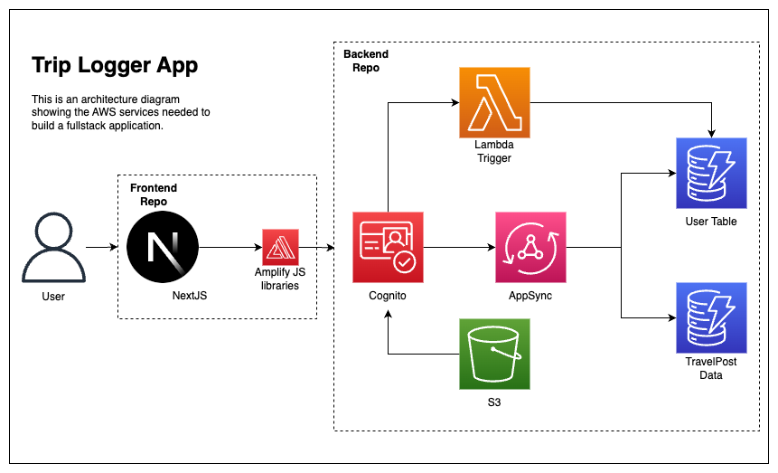

# AWS Amplify Chat App NextJS Frontend

## Infrastructure



## Documentation

- To get started with AWS AppSync in your JavaScript, TypeScript, or Flow application, use the AWS Amplify toolchain. First install the AWS Amplify CLI:

  - `npm install -g @aws-amplify/cli`

- After installing the CLI, navigate into the root of your JavaScript, TypeScript, or Flow project directory and run:

  - `amplify init`

- Add the codegen category to your project.

  - `amplify add codegen --apiId YOUR-API-ID`

- This will automatically generate GraphQL documents (queries, mutations, and subscriptions) and generate types for your JavaScript, TypeScript, or Flow application. If you modify the generated documents or your API's schema, you can regenerate the client code anytime with:

  - `amplify codegen`

## Getting Started

This is a [Next.js](https://nextjs.org/) project bootstrapped with [`create-next-app`](https://github.com/vercel/next.js/tree/canary/packages/create-next-app).

First, run the development server:

```bash
npm run dev
# or
yarn dev
```

Open [http://localhost:3000](http://localhost:3000) with your browser to see the result.

You can start editing the page by modifying `pages/index.js`. The page auto-updates as you edit the file.

[API routes](https://nextjs.org/docs/api-routes/introduction) can be accessed on [http://localhost:3000/api/hello](http://localhost:3000/api/hello). This endpoint can be edited in `pages/api/hello.js`.

The `pages/api` directory is mapped to `/api/*`. Files in this directory are treated as [API routes](https://nextjs.org/docs/api-routes/introduction) instead of React pages.

## Learn More

To learn more about Next.js, take a look at the following resources:

- [Next.js Documentation](https://nextjs.org/docs) - learn about Next.js features and API.
- [Learn Next.js](https://nextjs.org/learn) - an interactive Next.js tutorial.

You can check out [the Next.js GitHub repository](https://github.com/vercel/next.js/) - your feedback and contributions are welcome!

## Deploy on Vercel

The easiest way to deploy your Next.js app is to use the [Vercel Platform](https://vercel.com/new?utm_medium=default-template&filter=next.js&utm_source=create-next-app&utm_campaign=create-next-app-readme) from the creators of Next.js.

Check out our [Next.js deployment documentation](https://nextjs.org/docs/deployment) for more details.
